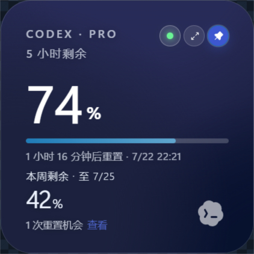
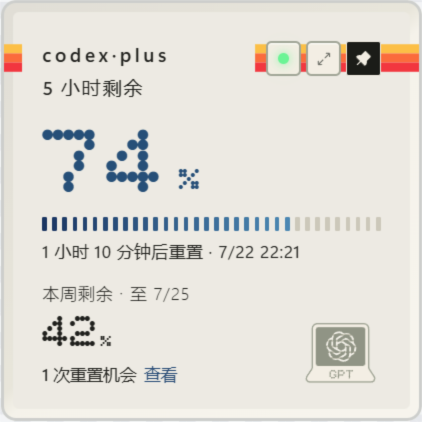

# Quota Float

A lightweight Windows/macOS desktop widget that keeps your Codex quota visible from your local Codex Desktop session.


## Highlights

- Shows your Codex plan, 5-hour quota, weekly quota, and next reset time in a compact always-on-top widget.
- Surfaces a compact live metric in the native status area: a Windows tray-icon value, or an optional macOS menu-bar readout.
- Uses clear quota states for healthy, caution, and critical remaining usage.
- Collapses into a small floating orb when idle, then expands on hover.
- Indicates whether quota is currently being consumed.
- Includes persistent expansion, always-on-top controls, and localized tray actions.
- Falls back to a clearly marked weekly-quota view when the 5-hour window is unavailable.
- Checks for app updates automatically and supports signed in-app updates on Windows.
- Shows reset credit count and available reset-credit expiration times when the quota service provides them.
- Handles stale data, signed-out sessions, unavailable quota responses, and loading states without fabricating values.

## Screenshots

| Quota states | Floating orb | Reset credit expiration |
| --- | --- | --- |
|  |  |  |

### Weekly quota fallback

| Expanded weekly view | Weekly quota orb |
| --- | --- |
|  |  |

### Dark healthy state



The preview uses mock quota data only; it does not contain account, device, or license information.

## Repository Metadata

Suggested repository description:

```text
A lightweight Windows/macOS desktop widget that keeps your Codex quota visible from your local Codex Desktop session.
```

Suggested topics:

```text
codex, quota, tauri, react, rust, desktop-app, windows, macos, productivity
```

## How It Works

Quota Float reads the existing Codex Desktop login state on your machine and queries Codex/ChatGPT quota endpoints with that session. It does not estimate usage from local token counts and does not redeem reset credits or modify account settings.

Browser preview uses mock data. Real quota reading requires the Tauri desktop app and an existing Codex Desktop login on the same machine.

## Download

The current public release is **v0.2.10**. Download the installer for your platform from [GitHub Releases](https://github.com/change-42-yhmm/quota-float/releases/latest):

- Windows (recommended): [Quota.Float_0.2.10_x64-setup.exe](https://github.com/change-42-yhmm/quota-float/releases/download/v0.2.10/Quota.Float_0.2.10_x64-setup.exe)
- Windows (MSI): [Quota.Float_0.2.10_x64_en-US.msi](https://github.com/change-42-yhmm/quota-float/releases/download/v0.2.10/Quota.Float_0.2.10_x64_en-US.msi)
- macOS Universal (Apple Silicon and Intel): [Quota.Float_0.2.10_universal.dmg](https://github.com/change-42-yhmm/quota-float/releases/download/v0.2.10/Quota.Float_0.2.10_universal.dmg)

### What's new in v0.2.10

- Displays the selected provider's current metric in the Windows tray icon; when API spend is available it is shown there, otherwise the icon shows the remaining 5-hour quota.
- Adds an optional macOS menu-bar readout with the same selected-provider metric.
- Opens the supporter panel on the first two launches after an upgrade, while preserving existing local licenses and preferences.
- Keeps the widget local-first, with clearer unavailable and stale states instead of estimated quota values.

Updater artifacts are signed with the project's Tauri update key. Windows Authenticode signing and macOS notarization are separate platform-signing steps; builds without those certificates may still trigger SmartScreen or Gatekeeper warnings.

## Feedback

Please use GitHub Issues for bugs, compatibility reports, and feature requests:

https://github.com/change-42-yhmm/quota-float/issues

## Supporter skins

The standard installer includes the free default appearances and can unlock optional supporter skins with a signed, device-bound license. Licenses are verified locally; the app does not send device request codes or license text to a service.

### Dark healthy-state previews

Blur and Computer are optional supporter skins. These previews use mock quota data and do not reveal any account, device, or license information.

| Blur | Computer |
| --- | --- |
|  |  |

## Privacy Boundary

Quota Float is local-first and intentionally narrow:

- Reads the local Codex Desktop login state only to query Codex quota.
- Sends the existing Codex access token only to ChatGPT quota endpoints.
- Stores only widget preferences in its own app config directory.
- Does not store Codex tokens, account IDs, prompts, chat history, raw quota responses, or local auth paths.
- Does not include telemetry, analytics, crash reporting, or third-party tracking.
- Does not redeem reset credits or modify account settings.

See [PRIVACY.md](PRIVACY.md) and [SECURITY.md](SECURITY.md) for the full boundary.

## Accuracy Boundary

Codex quota is read from Codex/ChatGPT quota service responses. If the response format changes, the app shows an unavailable or stale state instead of inventing quota values.

## Development

Requirements:

- Node.js 20+
- Rust stable
- Tauri 2 system dependencies for your platform

```bash
npm install
npm run dev
npm run test
npm run build
npm run tauri dev
```

After Codex Desktop updates, run the compatibility check:

```bash
npm run check:codex
```

See [docs/CODEX-UPDATE-CHECK.md](docs/CODEX-UPDATE-CHECK.md) for the automated update-check workflow and optional Task Scheduler setup.

## Build

```bash
npm run tauri build
```

On Windows, Tauri may download WiX to create an MSI installer. If WiX download fails, the release executable may still be produced at:

```text
src-tauri/target/release/quota-float.exe
```

## Release

GitHub Actions are configured for:

- CI on push/PR: frontend tests, Rust tests, web build, Tauri build.
- `v*` tags: Windows and macOS Universal installers, updater signatures, `latest.json`, and a public GitHub Release.

See [docs/GITHUB-RELEASE-CHECKLIST.md](docs/GITHUB-RELEASE-CHECKLIST.md) before publishing a version for others.

Do not upload local credentials, `.codex`, `.env*`, screenshots with personal data, `node_modules`, `dist`, `src-tauri/target`, or local installers to source control.

## License

MIT
